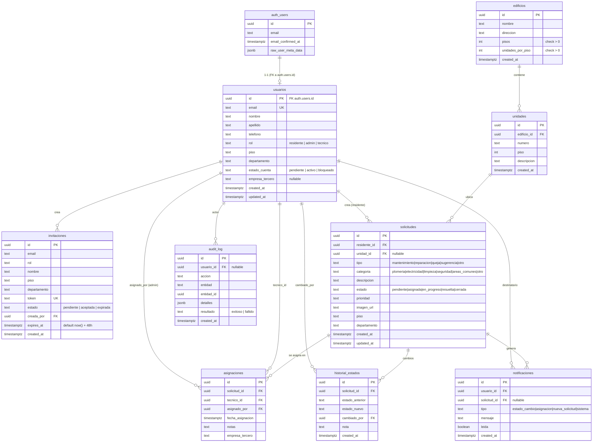

# Zity · Modelo de datos

> Estado al cierre del Sprint 3 (post-auditoría pre-Sprint 4) — extraído directamente del proyecto Supabase `hjxlahdvwqenwedhbtsu` (rama principal).
>
> Migraciones aplicadas:
> - `20260415163716 · create_tables`
> - `20260415163741 · auth_triggers_and_rls`
> - `20260422190400 · sprint2_schema` — rename profiles → usuarios y nuevas tablas
> - `20260422192733 · sprint2_fix_functions_profiles_to_usuarios`
> - `20260422222347 · sprint2_harden_insert_policies` — cierre de policies permisivas detectadas por el advisor
> - `20260428xxxxxx · sprint3_audit_security_perf_hardening` — eliminó trigger `on_auth_user_verified`, policy anon de invitaciones, policies duplicadas en solicitudes/audit_log; reescribió todas las policies con `(select …)` para optimizar planes; añadió índices faltantes
> - `20260428xxxxxx · sprint3_audit_consolidate_policies` — consolidó policies permisivas múltiples en una sola por (rol, acción)

## Diagrama ER

## Tablas por módulo

### Módulo Usuarios (operativo · Sprint 2)

| Tabla | Propósito | Check constraints |
|---|---|---|
| `usuarios` | Perfil de aplicación ligado 1-1 a `auth.users`. El trigger `on_auth_user_created` inserta la fila al registrarse. | `rol ∈ {residente, admin, tecnico}`, `estado_cuenta ∈ {pendiente, activo, bloqueado}` |
| `invitaciones` | Tracking de invitaciones enviadas por el admin. Token único y `expires_at` con default `now() + 48h`. | `rol ∈ {residente, tecnico, admin}`, `estado ∈ {pendiente, aceptada, expirada}` |
| `edificios` | Datos del edificio gestionado. Una instancia = un edificio. | `pisos > 0`, `unidades_por_piso > 0` |
| `unidades` | Unidades habitacionales del edificio. | — |

### Módulo Mantenimiento (diseño anticipado · Sprint 3+)

| Tabla | Propósito | Check constraints |
|---|---|---|
| `solicitudes` | Solicitudes de mantenimiento creadas por residentes. | `tipo`, `categoria`, `estado` con dominios cerrados |
| `asignaciones` | Relación técnico ↔ solicitud, con `empresa_tercero` opcional. | — |
| `historial_estados` | Auditoría de cada cambio de estado de una solicitud. | — |

### Soporte global

| Tabla | Propósito | Check constraints |
|---|---|---|
| `notificaciones` | Bandeja por usuario. | `tipo ∈ {estado_cambio, asignacion, nueva_solicitud, sistema}` |
| `audit_log` | Registro de acciones administrativas. Solo admin lee; solo service_role escribe. | `resultado ∈ {exitoso, fallido}` |

## Triggers y funciones

| Objeto | Schema | Tipo | Responsabilidad |
|---|---|---|---|
| `handle_new_user()` | public | SECURITY DEFINER · PLPGSQL | Crea fila en `usuarios` al registrarse un usuario en `auth.users`. Copia nombre, apellido, rol, piso, departamento desde `raw_user_meta_data`. EXECUTE revocado de `anon` y `authenticated`. |
| `handle_updated_at()` | public | SECURITY DEFINER · PLPGSQL | Refresca `updated_at` en `UPDATE` de `usuarios` y `solicitudes`. EXECUTE revocado de `anon` y `authenticated`. |
| `get_user_rol()` | public | SECURITY DEFINER · SQL · STABLE | Helper que devuelve el rol del usuario autenticado actual. Se usa en policies RLS envuelto en `(select …)` para que Postgres la cachee con `initPlan`. EXECUTE revocado de `anon`. |
| `on_auth_user_created` | auth.users | trigger AFTER INSERT | Dispara `handle_new_user`. |
| `set_profiles_updated_at` | public.usuarios | trigger BEFORE UPDATE | Dispara `handle_updated_at`. (Conserva el nombre histórico `profiles` aunque la tabla se renombró a `usuarios`.) |
| `set_solicitudes_updated_at` | public.solicitudes | trigger BEFORE UPDATE | Dispara `handle_updated_at`. |

**Eliminados en la auditoría pre-Sprint 4:**
- `handle_user_verified()` y el trigger `on_auth_user_verified`: activaban `estado_cuenta='activo'` automáticamente al confirmar el email, contradiciendo el flujo donde el admin debe aprobar la cuenta primero.

## Edge Functions

> Ambas funciones usan `verify_jwt: false` en el deploy y validan ellas mismas el token.
> La validación se hace con `supabase.auth.getUser(token)` (que verifica la firma criptográfica
> contra la clave secreta del proyecto) — **no** con decodificación manual `atob` del payload,
> que era el patrón anterior y permitía falsificar JWTs.
>
> CORS restringido a `https://zity.site`, `https://www.zity.site` y `localhost` para dev.
>
> Helpers compartidos en `supabase/functions/_shared/auth.ts`: `requireAdmin`, `corsHeaders`, `jsonResponse`.

| Función | Responsabilidad |
|---|---|
| `invitaciones` | `accion='crear'`: valida admin, llama `inviteUserByEmail`, registra en `invitaciones` con `expires_at = now() + 48h`, audita. `accion='reenviar'`: regenera link con `generateLink({type:'invite'})` y actualiza `expires_at`. |
| `bloquear-cuenta` | Valida admin, rechaza auto-bloqueo (`caller.id === target.id`), actualiza `estado_cuenta`, aplica/revoca `ban_duration` para invalidar sesión activa, audita. |
